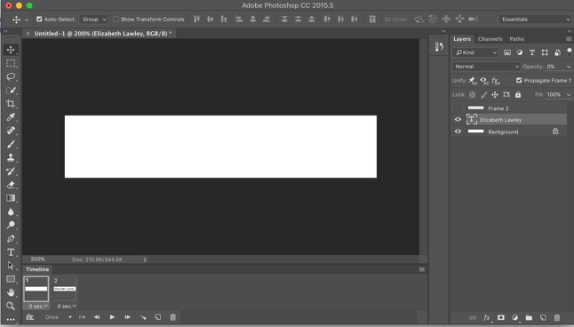
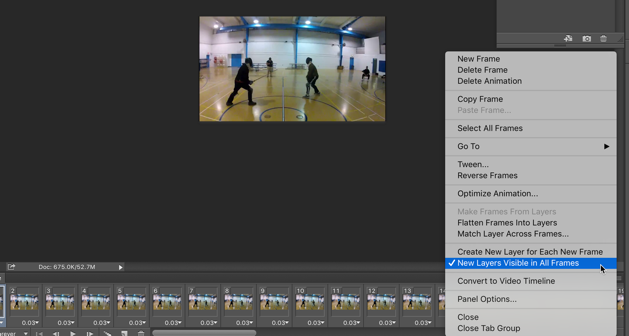

# Animation Exercise

Animation is a means of drawing attention and emphasis to your interfaces by leveraging the power of movement and by making things expressive.  Creating the illusion of movement requires the use of time and the transformation of an image between frames.  Photoshop has a reasonable basic capability to create frame animation and to use interpolation to do "tweening" of intermediate frames.  

## Part 1: Frames and Tweening

1. Open Photoshop and choose File > New to create a new graphic.  Set the dimensions to 600 pixels wide by 120 pixels high with a resolution of 96 ppi. Set the background to white. (Because we will be creating an animated GIF image, you could use a transparent background if you wanted, but for the purposes of this exercise a white background will make things easier to see).  I increased magnification to about 200% for easier viewing/editing.

1. Choose the Text Tool and click on the new graphic canvas you have just created.  Type in your own name (in place of "Headline News" in the example below).   I used Helvetica Neue, 54pt, with a black fill (text color) as your settings (you may need to alter either the typeface or the size to have your name fit properly).  

1. Open the Timeline panel (Window > Timeline), choose "Create Frame Animation" from the menu, and then click on the button to create a timeline. You should see one frame in the bottom left corner when you're done. 

1. Open the menu in the top right corner of the Timeline panel and make sure that `Create New Layer For Each Frame` is selected. 

1. We're going to make our text scroll across the canvas, and fade in as it does so. To start with, let's move the text so it's off the left of the canvas. Choose the Move tool, and drag the text layer to the left, so part of it is still visible.  

1. This is our starting frame. Now, let's add our ending frame. Add a new frame using the "Duplicate selected frame" button at the bottom of the animation panel (it's next to the trash can, and looks like a document icon). Make sure that frame 2 is selected, and use the Move tool to drag the text to the right edge of the canvas.  

1. We want our text to not only scroll to the right, but also to "fade in" as it does. So, click on the first frame, and then, in the Layers panel, turn the opacity down to 0 on the text layer. Make sure your second frame still has an opacity of 100 (Photoshop might change that on you!). 

1. If we animate this now, with only two frames, we won't see much motion or change--we need more frames. Select both frames in the timeline (hold the shift key and click on whichever one isn't currently selected), then, in the Animation panel dropdown menu (on the far right), select Tween... Let's add, say, 20 frames or so (you can add more if you want; the more frames, the smoother the animation, but also the longer it will take). Make sure both "Position" and "Opacity" are checked under parameters. 

1. Now when you play the animation, it will fade in and move to the right at the same time. We probably only want this to loop once, as it would look weird to fade in and move, then jump back and fade in and move all over again. But we could also make it move back to the left and fade out again!

1. Select the final frame of the animation, and on its dropdown, select 1.0 Seconds. This will keep the words visible for a moment before they move away and vanish again. Then, select all the other frames (the same way you did in step 7; don't select the last frame). Under the Animation panel menu (top right corner of the animation panel), select "Copy Frames." Now we've got the entire sequence, except for the 1-second "pause," copied.

1. Click on the last frame (to select it and deselect the rest). Then, from the Animation panel dropdown, select "Paste Frames..." Be sure to select "Paste After Selection."

1. While newly pasted-in frames are still selected, go to the Animation panel menu again and select "Reverse Frames." Now, play the animation and see how it looks--if you did this all properly, the text should scroll in from the left and fade in, then a second later scroll back left and fade out. 

1. Save your changes to the PSD file, and then export it as an animated GIF using the `Export->Save for Web (Legacy)` option. 

## Part 2: Rotoscoping a Sword Fight

Download the file [shortsword.mp4](shortsword.mp4). This is Creative Commons licensed footage of a fencing demonstration. You will be rotoscoping (drawing on the video) as a form of animation.

1. From the file menu in Photoshop, choose Import -> Video Frames to Layers. 

1. Make sure that the Make Frame Animation option is checked.

1. Check the `Limit to Every ___ Frames` option and choose every 6 or 8 frames. That will give you enough frames to work with without having too many. It is very important that you do NOT import every frame (unless you want to spend your entire weekend working on this). 

1. In the top right corner of the video timeline, select "New Layers Visible in All Frames". 

1. In the Layers palette on the right side of the screen, select all of the layers (there should be 80 or more), and then click on the file folder icon to put them into a new group. Label the group "Video".

1. Close the Video folder to hide the layers, and click the file folder icon to create a new (empty) group/folder for your rotoscoping layers. Label it "Rotoscoping".

1. IMPORTANT: Now turn **off** the "New Layers Visible in All Frames" option from Step 4.

1.	Make sure the first frame in the video timeline is selected, and create a new layer in the Rotoscoping folder by clicking on the new layer icon in the bottom right corner of the layers panel.

1.	Use a soft brush and a bright color to change the sword being held by the person on the left from a metal fencing sword to a light saber.  

1.	After you've drawn over the first frame, select the second frame (if you followed the steps above correctly, the drawing that you did on the first frame should now disappear), and create another new layer. Draw over this one. Repeat the process of selecting a new frame, creating a new layer, and drawing over the video until you've done at least 60 frames. 

1.	After you have done at least 20 frames, try playing the video back to see how it looks. If you're happy with it, continue coloring the first sword for the rest of the video's frames.

1.	Now go back and do the other sword in a contrasting color. You can play and watch the movie at any time and you can change any frame of the rotsocoping without affecting the video itself.  

1.	Feel free to use rotoscope effects to alter other elements of the video clip such as garments, gloves, face-guards, background (you can add scenery and other characters if you wish)

1. When you are finished, use Export -> Render Video to make an mp4 file out of the rotoscoped clip.  Use an H.264 codec and pick a preset (for instance "Android phone 360p Widescreen") which will result in a reasonably small file size. Save it with the file name rotoscope.mp4 in the "week11" folder you created in Part 1. 

## Exercise Deliverables

Submit both animations to the myCourses dropbox. If you come to class on Thursday, it is due by 6pm on Saturday, November 11th.

