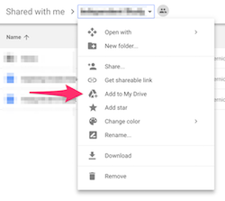

# Week 1 Thursday Exercise: Google Drive and Slack Collaboration

1) Log into RIT's Google Apps site (https://google.rit.edu), go to the Drive section, and select the "Shared With Me" option in the left sidebar. You should see a folder for your group (e.g. "IGME.110.2017 Group X"). If you don't see it, let the professor or TA know there's a problem. 

2) Open the group folder, and from the drop-down menu next to its name at the top of the screen, choose "Add to Drive"

3) Open the Week 01 document and add some notes from today's lecture. If other group members have already entered notes, you can add to them, edit them, format them, etc. 

4) In a different browser tab, open the class Slack site at https://lawley-110-2017.slack.com/, and find your group's private channel ("groupX"). (If you don't see a private channel with your group's number, it's because we didn't get your Slack ID in time to add it; ask your professor or TA to add you now.)

5) ***Need to test non-admin process for adding Google Drive authentication***

6) Configure your Slack notifications. You can change the "do not disturb" window (by default it's set from 10pm to 8am), and/or change notification preferences on a channel by channel basis. (Because the #announcements channel is used only by your professor for class-wide announcements, it's not a good idea to mute that channel.) If you have an iOS or Android mobile device, I highly recommend installing the Slack app so that you don't have to be in front of a computer to get notifications.