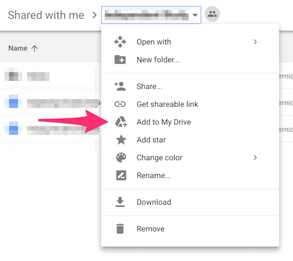

# Week 1 Thursday Exercise: Google Drive and Slack Collaboration

1. Log into RIT's Google Apps site (http://google.rit.edu), go to the Drive section, and select the "Shared With Me" option in the left sidebar. You should see a folder for your group (e.g. "IGME.110.2017 Group X"). If you don't see it, let the professor or TA know there's a problem. 

2. Right-click the folder, and from the drop-down menu choose "Add to My Drive"  

3. Open the Week 01 Notes document inside the folder and add some notes from this week's lectures. If other group members have already entered notes, you can add to them, edit them, format them, etc. There doesn't need to be a lot of content, but when we look at the version history for the file (File->Version History->See version history), we should see some evidence of meaningful partcipation by you. 

4. In a different browser tab, open the class Slack site at https://lawley-110-2017.slack.com/, 

5. Find your group's private channel. (If you don't see a private channel with your group's number, it's probably because we didn't get your Slack ID in time to add it; ask the professor or TA to add you now.)

6. [Add Google Drive access to your Slack account](https://get.slack.help/hc/en-us/articles/205875058-Google-Drive-for-Slack), and share the Week 1 Notes document from Google Drive to your group's private channel.

7. Configure your Slack notifications. You can change the "do not disturb" window (by default it's set from 10pm to 8am), and/or change notification preferences on a channel by channel basis. (Because the #announcements channel is used only by the professor and TA for class-wide announcements, it's not a good idea to mute that channel!)

***If you have an iOS or Android mobile device, I highly recommend installing the Slack app so that you don't have to be in front of a computer to get notifications!***