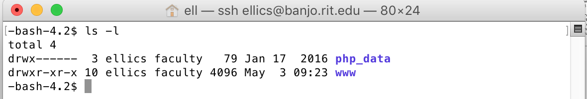

# Week 5 Preparation: Connecting to the RIT Web Server
Please complete this assignment and inform me of any problems BEFORE Monday (but sooner is much better). There are TWO PARTS to this exercise—make sure you do part II, “Testing the Connection,” as well. 

## Part I (for Windows only): Logging Into the RIT Web Server 

Launch the application PuTTY, which is installed on all of the lab machines. (If you would like to have this software on your own machine, it is free software that can be downloaded from https://www.chiark.greenend.org.uk/~sgtatham/putty/latest.html; you only need the putty.exe file.) 


Type banjo.rit.edu into the host name box, make sure that the SSH button is selected, and click Open at the bottom of the dialog box. You'll be prompted for a login--use your RIT username and password. If you are asked a question about the security key on the server, say yes. Type in your password when prompted.

*(Note: When you type in your password, you will not see any characters on the screen. It will be accepting your input, but you will not see any characters on the screen as you type.*)

If you see the following text, it means you've successfully connected:

```
Last login: Thu May 18 11:57:55 2017 from lawleymbp.wireless.rit.edu

RIT information technology resources are for the use of the RIT community only. By using RIT information technology resources you acknowledge that you have read and comply with RIT's Code of Conduct for Computer and Network Use and RIT's Information Security Policy and Standards. Use of RIT information technology resources may be monitored and unauthorized use is strictly prohibited.
```

If you get an error message, or have difficulty connecting,  [contact the ITS help desk](https://www.rit.edu/its/help-support/hours-contact) for assistance--you’ll need to be able to log in properly in order to do the week 5 in-class exercises. 

Once you've successfully logged in, continue to Part II.

## Part I (for Macs only): Logging Into the RIT Web Server

Launch the Terminal application on your Mac, and type in the following (replacing *yourUserName* with your RIT User ID). 

`ssh yourUsername@banjo.rit.edu`  

After typing in the command, hit enter. If you are asked a question about the security key on the server, say yes. Type in your password when prompted. 

*(Note: When you type in your password, you will not see any characters on the screen. It will be accepting your input, but you will not see any characters on the screen as you type.*)

If you see the following text, it means you've successfully connected:

```
Last login: Thu May 18 11:57:55 2017 from lawleymbp.wireless.rit.edu

RIT information technology resources are for the use of the RIT community only. By using RIT information technology resources you acknowledge that you have read and comply with RIT's Code of Conduct for Computer and Network Use and RIT's Information Security Policy and Standards. Use of RIT information technology resources may be monitored and unauthorized use is strictly prohibited.
```

If you get an error message, or have difficulty connecting, [contact the ITS help desk](https://www.rit.edu/its/help-support/hours-contact) for assistance--you’ll need to be able to log in properly in order to do the week 5 in-class exercises.

Once you've successfully logged in, continue to Part II.

## Part II:  Testing the Connection 

After connecting to the server, type in the command  `ls`  (LS in lowercase) to show a list of your home directory contents. At a minimum, you should see `php_data` and `www` in the display.  



If you do *not* see php_data  and www listed when you typed in the `ls` command, please contact the ITS Help Desk immediately (and let me know, as well)--it means RIT did not configure your account properly, and we need to fix that before class next week.

That’s it! You’re done. To close your session, you can type either `logout` or `exit`, and quit the PuTTY or Terminal program. 

