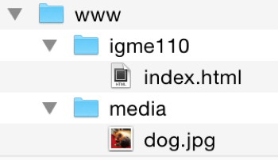
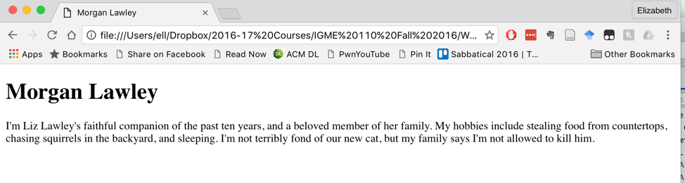
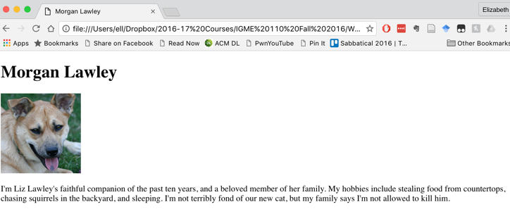
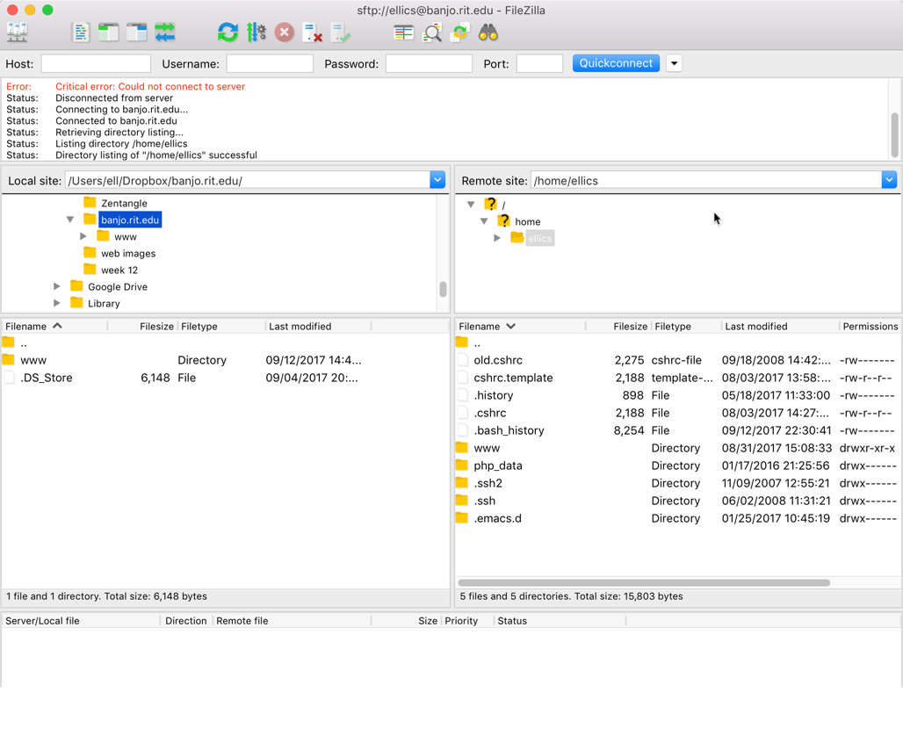

# Web Publishing Exercise 

## Overview & Goals

In today's exercise, you'll use Visual Studio Code to create some web pages. Much of the HTML I'm asking you to create was already covered in the HTML Essential Training tutorial, so this should primarily be review. 

You will then use an FTP program to upload the files you've created to the RIT web server, and will also be adding a configuration file to your RIT web space to override some of the server's default behavior.

## Setting Up Your Folders and Files

On your computer (or on a USB drive) create a folder called RIT Web. Inside that folder, create a folder called www. Inside of the www folder, create a folder called igme110. And inside of the igme110 folder, create a folder called media. The www folder represents your www directory on 'banjo.rit.edu'. The igme110 folder is where all of your exercises and projects for this class will be stored. 




## Creating Your Class Home Page

Using VS Code (or your HTML editor of choice), create a new HTML file in the igme110 folder called index.html. 

In the head of the document, add this content to the title element (using your name, of course): `<title>Elizabeth Lawley's IGME 110 Page</title>`

In the body of the document, add a level 1 heading element containing your name. Below that, add a paragraph element that that includes a few lines about yourself. Save the file. 

Open a web browser, and in the browser use the File-->Open command to locate and display the index.html file you just created. (Or, if you have previewing capability in your editor, you can use that.) It should look something like this:

 

## Adding an Image

Find a Creative Commons-licensed image on the web, or an image that you own the rights to, that you’d like to include on your page. Save it in your igme110 folder. 

You’re going to add code to your HTML to display the image properly on the page. In Komodo edit, put your cursor after the heading with your name, but before the first paragraph of text. (If there’s not a blank line there already, you can add one, to make the code easier to read.) Type in `` (or, use the Emmet shortcut by typing `img` and pressing tab). 

Between the quote marks following src, you're going to add the *relative* path to the image you downloaded. Because the image is in the same directory as your html file, the relative path is just the file name--if you don’t provide any other information besides a file name, the browser will assume that the image is in the same directory as the HTML file it’s displaying. My image file is called dog.jpg, so my tag would now look like this:
``````

Between the quote marks following alt, you’re going to add text that will display if the browser is unable to display images. My tag now looks like this:
``````

Save your file, go back to the browser window that you used to view it in the last section, and reload the file. It should now look something like this:

 

Add a paragraph of text after the title, describing the image. Include information about where you got the image--including a link back to the source if it's not an image you took yourself.
 
If your image isn’t showing up properly, ask for help now! (If it’s much too big to display properly on the page, try finding and downloading a smaller image from the web. )

## Relative References to Other Directories

As your web site gets bigger, keeping all your files in the same directory makes it harder to keep them organized. Web developers typically have different directories for different parts of their site, and also often  keep images in a separate directory. You created a media folder in your www directory, and that’s where we’re going to put the images you use on your site. 

On your computer, open the igme110 folder you created. Move your image file from igme110 into the media folder. Your structure should look like this:

 

Now try reloading your page in the browser again.  If you followed the directions properly, the image won’t load now. The browser is still looking for it in the same directory as the HTML file, but it’s not there. We need to tell the browser how to find the image, using a relative path. 

In your html file, change the img tag so that it looks like this (using your image information, of course):
   ``````

This tells the browser to look in the media folder that’s inside the igme110 folder. Reload the page in the browser to see if it worked. The image should show up again. (If not, ask for help!)

## Creating and Linking to a Second Page

Using your HTML editor, create a new HTML 5 file. Save it with the name page2.html. Give it a title of “Your Name’s Second Page.” (Put that in the title tag, as well as in a level 1 heading on the page.) 

Add an image to this page, as well, and a paragraph of text with whatever content you'd like. 

Add a second paragraph with a link back to your index.html page. Because we’re using relative links, and because the file is in the same igme110 directory, you only have to specify the file name, like this:
   ```<p><a href="index.html">My First Page</a></p>```

Go back to your index.html file, and add a link at the end of that page to your new HTML file, like this:
```<p><a href="page2.html">My Second Page</a></p>```

Here's an example:


In your web browser, reload your index.html page, and make sure the links between your pages work properly. If they don’t, ask for help! 

## Uploading

Now we’ll use FTP (actually SFTP, which uses a secure connection to the server) to put your web pages onto the banjo server.

You can use whichever SFTP (secure File Transfer Program) you'd like to uplaod files to the server. In the IGM labs, we have FileZilla installed, so that's what's used in this documentation. (You can download FileZilla for your own computer at https://filezilla-project.org/download.php?show_all=1 -- if you're using Windows, I strongly suggest downloading the .zip file rather than the .exe file, since the executable file will try to install browser addons that can cause all kinds of problems.) 

Launch FileZilla.  Fill in the fields at the top with the following information, and click “Quickconnect”:


FileZilla may ask you if you want it to remember passwords—if you’re doing this in the lab, tell it no. If this is the first time you've used FileZilla on a lab computer, it may also give you a warning about an “unknown host key”—if that happens, check the box saying “Always trust this host” and then click OK. If you entered your user ID and password correctly, you should now see something like this:



The pane on the bottom left shows the files on your computer’s hard drive. In this case, it’s showing everything, including hidden files, that are on the main level of my computer’s hard drive. The pane on the right shows all the files, including hidden files, in your home directory on RIT’s web server. 

In the pane on the left side (local site files), you’ll need to find the directory that you created at the beginning of this exercise. If you put it on a thumb drive, the drive should show up in the Volumes directory. If you put it on the Desktop, it should be in the student directory inside of the Users directory. You want to find your www folder and open it, so that you can see the igme110 and media folders in the left pane. (If you’re using Mac, there may also be a hidden file called .DS_Store, which you can ignore—it’s a Mac system file that is hidden.) If you have trouble finding your files, ask for help. 

In the pane on the right side (server files), double click on the www directory. You should see the 110 directory that you created in Tuesday’s exercise. Leave that alone until you’ve gotten credit for the exercise! 

Once you’ve got the www directory on your local computer on the left side, and your www directory on banjo on the right side, you’re going to drag the igme110 directory from the www folder on the left (your computer) to the www folder on the right (the server). This will copy the folder and its contents to the web server. The file list on the right side should update to show the the new directories. 

Now you need to test the files on the web server, to see if they’re accessible. Use a browser to go to `http://people.rit.edu/youruserid/igme110` (substituting your RIT ID for *youruserid*)

If the files and images show up, great! But it’s possible that they won’t, because the access to the files may not be set properly by default. 

## Fixing Folder & File Access Permissions

In FileZilla, select the www folder in the right pane (on the server)
Right click on the folder in the right pane, choose “File Permissions” and make sure the permissions include read write and execute for the owner (that’s you), and read and execute for everyone else. The number in the box at the bottom should read “755” which is shorthand for those permissions. (You can either type the number into the box at the bottom, or check the boxes next to the permissions you want.) Make sure the box that reads "recurse into subdirectories" is selected, and choose "Apply to directories only." Click OK. This should change the permissions for the www directory, and all directories below of it, including the igme230 directory and the test directory. 

Once you’ve changed the permissions on the folders, you need to repeat that process to change the permissions for the individual files. They don't need execute permissions, so the shortcut for their permissions is 644 rather than 755.  

  

Once you've changed the folder and file permissions for www and everything inside of it, go back to the browser and try loading `http://people.rit.edu/youruserid/igme110` again. If it still won't load, ask for help!

Notice that the URL I gave you only has the directory name (igme110) and not a file name. That is because banjo, like most web servers, automatically looks for a file called index.html in a folder if no other file was specified. If you were to include the file name in the URL (e.g. `http://people.rit.edu/youruserid/igme110/index.html`), it would also recognize that file and load it. But if you end the URL with the directory name and don’t specify a file, the server will automatically load the index.html file if there is one in that directory. 

Once your page has displayed properly, view the source in the web browser (if you're using Chrome, type Ctrl-U to display the page source). You'll probably see a big block of completely unfamiliar code near the top of your page, where your first image is embedded. In the next section, I'll explain where that came from, and how we can make it go away. 

## Fixing Banjo

'banjo.rit.edu' uses specific server-techniques to help pages across RIT's sites load faster, but these techniques have the side effect of making pages on the server harder for us to debug and to validate.

To fix this, you're going to need to copy a file from my www directory to yours via the command line. As you did on Tuesday, use PuTTY (or Terminal on a Mac) to connect to 'banjo.rit.edu', and then type the following commands, *exactly* as they appear here:

```
cd www
cp ~ellics/www/.htaccess .htaccess
chmod 644 .htaccess
```

The first line changes directories into your www directory. The second line copies a file called .htaccess from **my** www directory (ellics/www) to your current location, which is **your** www directory. And the third line changes the permissions on the .htaccess file so that the web server can read it. 

Go back to your browser, reload your index.html page, and view the source again. If it all worked properly, the block of code inserted by the server that you saw before should now be gone. 

## Due Date
You must have this exercise complete by noon on Saturday, September 30th. On Saturday, my TA will check to see if you completed the work by loading  `http://people.rit.edu/youruserid/igme110` and making sure that the files are present and include the requested components. 